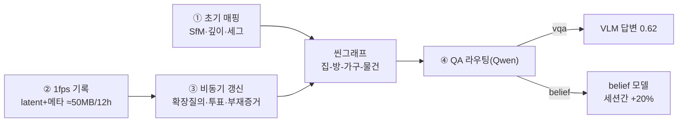

# 하루-스케일 에고센트릭 씬그래프 메모리 — 시스템 공유 문서

2026-08-19 · khronos v3 기준. 모든 수치는 본 저장소 실측값이다. 원 설계 중 아직
구현하지 않은 항목은 본문에서 빼고 문서 끝 **TODO** 로 모았고, 실측이 원 설계를
바꾼 지점은 **[설계 교정]** 절에 따로 정리했다.

**한 줄 요약** — 웨어러블 1fps 영상만으로 집의 계층 씬그래프(집-방-가구-물건)를
만들고, 하루치 기록을 ~50 MB 로 쌓았다가 비동기로 그래프를 갱신하며, "그 물건이
지금 어디 있나(belief)"까지 답한다.



---

## 1. 초기 맵·씬그래프 구축 — 처음 한 번, 자세하게

### 1-1. Perception 3종: mono depth · pose · segmentation

| 기술 | 구현 | 핵심 수치 |
|---|---|---|
| **Pose** | 증분 SfM (PnP 등록 + 다시점 삼각측량 + 희소 BA) | 삼각측량 검증(`accept_point`) 없으면 씨앗 BA 재투영 RMS **166,215px** → 검증 후 정상 수렴. 물체 랜드마크 공유 기반 **루프 클로저**(섬 병합·브리지) 포함 |
| **Mono depth** | DA3 + **SfM 포즈로 역깊이 아핀(a,b) 재정렬** | 물체 배치오차 **1.61 m → 0.72 m** (단일 최대 개선). 미터 스케일은 바닥 사전(착용 높이 1.55 m)으로 고정 |
| **Segmentation** | FastSAM(+BotSort 트랙) / OWLv2(오픈보캡 박스) | FastSAM 사전으로 방 서명 **0.971** ≈ GT 사전 0.966 (동률). OWLv2 존재판정 F1 **0.39~0.43** = CLIP(0.22~0.27)의 **1.7배**, 재현율 상한 0.29→**0.89** |

포즈-깊이 반복 보정: DA3 창을 SfM 랜드마크에 앵커링해 조각별 sim3 로 잇는다.
정보 한계로 ~0.75 m 에서 정체 — 깊이 재정렬(1.61→0.72 m)로 우회했다.

**무거운 SfM 은 이 단계 한 번뿐이다.** 운영 단계 갱신은 SfM 재실행 없이
FastSAM 트랙 + 방 서명(0.946)으로 그래프를 직접 갱신한다 — 정적 구조와 프레임
색인이 드리프트를 막아준다.

### 1-2. 계층 씬그래프: 집 - 방 - 가구 - 물건

| 층 | 방법 | 수치 |
|---|---|---|
| 방 분할 | **3D 궤적 군집**(중력 정렬 → 바닥 투영 → 체류 군집). 이미지 한 장 분류가 아니라 **위치**로 정한다 | 프레임-방 정확도 CLIP 한 장 분류 0.52 → **3D 군집 0.93** (1.9배) |
| 방 서명 | 같이 보이는 정적 물체 집합의 TF-IDF 투표 (포즈·기하 불사용) | ADT **112시퀀스** 교차 검증 **0.97** (우연 0.62) |
| 방 이름 | **Qwen 자유 생성** — 방 안 물체 조합을 통째로 주고 이름을 짓게 한다. 고정 방 목록 없음 | decoration 3/4 · Nymeria 부엌 정확 분리. ⚠️ 문법 제약(GBNF)을 걸면 `"json"` 퇴화 — **문법 제약은 단일 토큰 선택에만** |
| 가구 병합 | 카테고리 + 3D 근접(0.6 m) | — |

### 1-3. 열린 어휘: "물체 N" + class 는 attribute

노드는 `물체1, 물체2, …` 이고 클래스(노트북/머그)는 attribute 다. 방 타입·방
개수도 고정하지 않는다. **절제 실측**: 물체 클래스 전부 미지 / 방 타입 전부
미지로 바꿔도 belief top-1/top-3 이 **0.67/1.00 그대로** — 모델이 쓰는 것은
이름표가 아니라 방-가구 소속 구조와 관측 이력이다. **새 물체·새 집이 와도
재학습 없이 그대로 돈다.**

---

## 2. 1fps 하루 기록 — 가볍게 쌓는다

### 2-1. 공간 1차 필터링

"지금 어느 씬그래프(집/사무실) 안인가"부터 거른다. 실측 대응물: Nymeria 는
세션들이 **위치 식별자(graph_uid) 하나로 같은 좌표계**에 묶인다 — 같은 집
11세션이 ±8 m 오차로 **정합 절차 없이** 한 지도가 됐다. 실외 GPS 필터는 이
식별자를 실외에서 만드는 문제로 환원된다(→ TODO).

### 2-2. 프레임은 latent + 메타데이터 두 벌로

원본 영상은 버리고 프레임당 **임베딩(CLIP)과 검출 메타데이터(OWLv2)를 둘 다**
남긴다. 양자택일이 아니라는 것이 8개 층 개별 실측의 결론이다:

| 질문 유형 | 지각층 | 근거 |
|---|---|---|
| **사건** — "언제/어디서 그랬나" (검색·QA) | **CLIP latent** | 검색 hit@5 0.75 — OWLv2 를 섞으면 0.55, QA 0.47→0.38 로 **모든 스킬에서 악화** |
| **상태** — "그 물건이 거기 있나" (지도·belief) | **OWLv2 메타** | 가구 belief top-1 **7.5배** · 세션 간 belief 기준선 대비 −22%→**+20% (부호 반전)** |

한 문장 원리: **높은 재현율은 "거기 있나"에는 이득, "언제였나"에는 손해다** —
물건이 보이는 프레임을 다 올리면 결정적 순간을 못 가른다.

### 2-3. 저장 예산: 12시간 ≤150 MB — 실측 환산 ≈50 MB

1fps = 43,200프레임/12h. 실측 파일 크기에서 환산:

| 항목 | 실측 | 12h 환산 |
|---|---|---|
| CLIP 512-d 임베딩 (npz 압축) | 1,951프레임 = 1.92 MB | **≈ 43 MB** |
| OWLv2 검출 메타 (문턱 0.3, ~9개/프레임, 이진 인코딩) | — | **≈ 1~5 MB** |
| (반례) OWLv2 원본 JSON 그대로 | 1,951프레임 = 17.3 MB | 384 MB — 문턱·인코딩 필수 |

**합계 ≈ 50 MB / 12h = 예산의 1/3.** int8 양자화 시 ~30 MB 까지 내려간다.

---

## 3. 비동기 씬그래프 갱신

### 3-1. 물체를 1fps DB 에서 찾는다

씬그래프의 각 물체를 질의로 저장된 임베딩/메타를 검색한다. 실사용 조건에서
물체·위치 hit@5 **0.75**. (비교 대상으로 적었던 0.70 은 **정답 선택지의 위치
표현을 질의에 결합한 answer-aware 검색** 값이다 — 4지선다 전용이라 개방형에서는
쓸 수 없는 설정이고, 프레임을 직접 주는 GT 오라클과는 다른 것이다.)
인과 마스크(질의 시각 이전만)로 전체 0.34→**0.47**.

### 3-1b. ⚠️ **검색은 반드시 시간·세션으로 좁혀야 한다** (2026-08-19, 중대 발견)

`hit@5 0.75` 는 **2세션(3,106프레임) 풀**에서 나온 값이다. 5세션(10,891프레임)으로
풀만 키우고 **같은 73문항**을 채점하니:

| 검색 후보 풀 | 전체 hit@5 | 물체·위치 | 상위5에 낀 타세션 프레임 |
|---|---|---|---|
| 2세션 3,106프레임 | 0.52 | **0.75** | 8% |
| 5세션 10,891프레임 | 0.37 | **0.30** | **44%** |
| **5세션 + 근거세션 제한** | **0.55** | **0.75** | 0% |

**물체·위치가 0.75 → 0.30 으로 무너진다.** 원인은 명확하다 — 상위 5프레임의 44%가
**다른 날 세션**에서 온다. 같은 집을 매일 찍으니 프레임이 서로 비슷하고, CLIP 은
"부엌 카운터 앞"을 구분하지 못한다. 후보를 근거 세션으로 제한하면 0.75 로
**완전히 복구**된다(풀 크기는 그대로).

이 문제는 **하루-스케일 시스템의 본질적 구멍**이다. 12시간 43,200프레임을 쌓으면
풀은 지금보다 4배 더 커지고, 며칠·몇 주가 누적되면 더 커진다. 즉 **저장 예산
(2-3)은 해결했지만 검색 정밀도는 시간 스코핑 없이는 유지되지 않는다.**

→ **설계 요구사항**: 검색은 (a) 인과 마스크(질의 시각 이전)에 더해 (b) **시간창
스코핑**이 필수다. "오늘", "어제 저녁", "요리하던 중" 같은 시간 단서를 질문에서
뽑아 창을 좁히거나, 창을 넓혀가며 재검색(coarse-to-fine)해야 한다. 이 스코핑
자체가 **씬그래프의 또 다른 소비처**다 — 물체의 마지막 관측 시각을 알면 그
근방으로 창을 잡을 수 있다.

⚠️ 이 발견으로 **QA 정답률 수치의 조건이 좁아진다.** 물체·위치 0.62 는 2세션
풀에서의 값이고, 5세션 풀에서 같은 설정을 돌리면 0.44 다(응답이 A 로 쏠리는
퇴화까지 동반 — 284문항 중 267개가 A). 시간 스코핑을 구현하기 전의 수치로 읽어야 한다.

### 3-2. 질의 확장 — 실측 끝에 **쓰지 않기로** 했다

원안은 확장 질의(키워드+이웃)로 검색을 넓히는 것이었고, 초기 실측에서 물체·위치
hit@5 가 0.55 → 0.70 으로 올라 채택했었다. 그런데—

**⚠️ 평가셋 문맥을 걷어내니 결론이 뒤집혔다 (2026-08-19).** SuperMemory 물체·위치
206문항 중 **164개(80%)가 상황 도입절**로 시작한다 — `"I'm prepping food at the
island. Where did I throw the empty red mesh bag earlier?"`. 실사용에서 사용자는
`"빨간 망사백 어디 뒀지?"` 만 친다. 도입절은 **데이터셋이 준 공짜 문맥**이므로
떼고 다시 쟀다(59문항에서 실제 제거됨):

| 질의 구성 | 질의 시점 LLM | 도입절 포함 | **도입절 제거(실사용)** |
|---|---|---|---|
| 질문별 Qwen 이웃 | 1.6초 | 0.70 | 0.70 |
| 상식 attribute (사전계산) | 0 | 0.50 | 0.50 |
| 관측+선별 attribute (사전계산) | 0 | 0.55 | 0.55 |
| 선별 attribute + 질문 원문 | 0 | 0.50 | 0.65 |
| **질문 원문 단독** | **0** | 0.55 | **0.75** |

**실사용 조건의 최선은 이웃 확장을 아예 안 하는 것이다** — 질문 원문만 CLIP 에
넣으면 0.75 로, 질의 시점 LLM 을 쓴 0.70 보다도 높다.

이유는 도입절의 성격에 있다. `"I'm getting ready to cook"` 은 **질문하는 지금의
상황**인데 검색이 찾아야 하는 것은 **과거에 물건을 둔 순간**이다. 현재 상황을
질의에 넣으면 엉뚱한(최근) 프레임 쪽으로 끌린다. 이웃 확장이 이득으로 보였던
것은 그 도입절 잡음을 희석해준 효과가 컸다 — 잡음이 없으면 확장도 필요 없다.

→ **검색층 결론: 질문 원문 그대로. 이웃 확장·질의 시점 LLM 둘 다 불필요.**
(이웃 attribute 는 계속 만든다 — 아래 3-3·3-4 의 belief·부재 문맥용이다.)

### 3-2b. 그래도 이웃 attribute 를 만드는 이유

검색에는 필요 없지만 **관측 후보 + LLM 선별** 방식의 attribute 는 다른 층이 쓴다.
생성 방식별 질적 차이(같은 실행 비교):

| 이웃 생성 | 물체·위치 | 예시 |
|---|---|---|
| 관측 PMI 그대로 | 0.50 | `salt → lid, glass lid, kitchen tongs` (일시적 동시출현) |
| 상식만 (물체 이름만 제시) | 0.50 | `soap → bathroom, shower` (**이 집을 모름** — 실제론 부엌 세제) |
| **관측 후보 + LLM 안정성 선별** | 0.55 | `soap → sink, counter, kitchen drawer` (**둘 다 교정**) |

선별 프롬프트는 관측된 후보 목록을 주고 *"나중에 이걸 찾을 때 쓸 앵커로 안정적인
것(가구·가전·고정 장소)만 고르고, 움직이거나 소비되어 사라지는 것(음식·봉지·
소형 도구)은 빼라"* 고 시킨다. 결과가 **이 집에 접지되면서 시간에 안정적인**
앵커 집합이라, 부재 판정의 문맥 게이트(3-4)와 belief 의 수용체 후보로 재사용된다.

### 3-2c. 구축 시 LLM 1회에 속성 더 얹기 — **실측 결과 효과 없음**

이웃 선별은 물체당 LLM 1회(구축·갱신 시점)이므로, 같은 응답에 다른 속성을 얹는
한계비용이 거의 0 이다. `scripts/object_attributes.py` 로 138개 물체에 대해
네 속성을 한 번에 받았다(프롬프트 영어, 후보 목록 밖 앵커는 버려 환각 차단):

```
anchors   관측 후보 중 안정적인 것만    mobility  fixed_appliance/furniture/portable/consumable
home      정위치 수용체                size      s / m / l
```

생성 분포: mobility `portable 120 · consumable 8 · furniture 5 · fixed_appliance 5`,
size `s 79 · m 54 · l 5`, home 상위 `kitchen drawer 39 · kitchen cabinet 39 · desk 12`.
**home 은 138개 중 125개(91%)가 FURN 24개 가구 후보에 매핑**돼 사전분포로 쓸 형태다.

가구 belief(OWLv2 thr 0.40)에서 각각 켜서 채점했다:

| 구성 | 문항 | top-1 | top-3 |
|---|---|---|---|
| 기준 (attribute 미사용) | 103 | 0.10 | 0.25 |
| + mobility 차등 게이트 | 93 | 0.09 | 0.27 |
| + home 사전분포 | 103 | **0.11** | 0.24 |
| + anchors 후보제한 | 103 | **0.11** | 0.23 |
| + 셋 모두 | 93 | 0.10 | 0.27 |

**어느 것도 개선하지 않는다.** ±0.01~0.02 는 103문항에서 1~2문항이라 잡음이다.
**동의어에 이어 두 번째 미채택이다.**

실패 원인이 속성마다 다르다 — 이게 다음 시도의 조건이 된다:

- **mobility**: 질문 키워드가 애초에 "사람이 찾는 물건"이라 120/138 이 portable.
  차등 게이트가 걸릴 대상이 fixed·furniture 10개뿐이라 **효과 상한 자체가 낮다.**
- **anchors**: 138개 중 81개가 빈 배열. PMI 후보를 뽑은 어휘 158개 중 가구·장소가
  31개뿐이라 **후보 목록에 안정적 랜드마크가 없었다.** LLM 이 정직하게 거부한 것.
  후보 풀에 가구 목록을 명시적으로 넣으면 달라질 수 있다.
- **home**: 형태는 좋은데(91% 매핑) belief 가 이미 관측 누적 사전분포를 쓰고 있어
  **정위치 사전값이 추가 정보를 못 준다.** 관측이 적은 초기(콜드스타트)에서만
  값어치가 있을 가능성 — 이 실험은 5세션 누적 후라 그 조건이 아니다.

→ **현재 결론: 속성 확장은 보류.** 이웃 선별 attribute 만 유지한다(3-2b).
소비처가 실측으로 확인된 속성만 넣는다는 원칙이 두 번 연속 지켜졌다 —
"한계비용이 0" 은 넣을 이유가 되지 못한다.

### 3-3. 갱신은 누적 투표 — 두 가지 실측 조건이 붙는다

관측을 방 단위로 **누적 투표**한 사전분포가 곧 갱신이다. 세션 간 belief 에서
이 사전분포가 최빈방 대비 **+20%** (0.632 vs 0.526)로 유일하게 기준선을 넘었다.

- **근접 게이트가 전제조건.** 방을 착용자 위치로 정하므로 문 너머 약한 검출이
  지도를 오염시킨다. 검출점수 문턱 0.35: 고정 가전의 세션 간 방 일치도
  0.53→**0.93** (stove 0.50→1.00), belief 0.378→0.632.
- **동의어 확장은 채택하지 않았다.** 재현율은 오르지만(0.89→0.96) 같은 폭의
  오검출이 **누적층을 오염** — belief 0.644→0.53 악화 실측. 지도는 관측을
  누적하므로 지각 오차가 증폭된다(개선도 악화도 같은 배율로).

### 3-4. 부재 증거 — "없어졌다"를 검색으로 확인

**부재 질의 = extended query − 키워드.** 키워드로 검색하면 물건이 보이는
프레임만 올라와(생존 편향) 부재가 관측 불가능하다. 문맥만으로 "있어야 할
장소"를 찾고 그 안에서 키워드 존재도를 재야 "그 자리에 없다"가 보인다.

실측 (ADT 2시퀀스, GT 이동구간 채점): 이동 물체 z 하락 +1.21 vs 정적 −0.12 —
⚠️ **철회(2026-08-20 ⑬)** — 0.761·p=0.014 는 카테고리 뭉개기 채점의 산물이다.
인스턴스 단위·이동 구간별로 바로잡으면 **AUC 0.49~0.50(우연)**. 더 근본적으로
지각층에 존재/부재를 직접 물으면 **AUC 0.506** 이라 채점을 어떻게 고쳐도 우연 위로
못 올라간다. 아래 설계(문맥 게이트·키워드 제거)는 원리로서는 유지하되 **수치는
미확정**이다. 판정 전제는 문맥 게이트: 그 장소를 실제로
본 프레임이 없으면 부재를 주장하지 않는다(**증거의 부재 ≠ 부재의 증거**).
지각층은 CLIP 유지(OWLv2 0.752 로 동급, 교체 이득 없음).

---

## 4. 사용자 QA — 라우팅 후 VQA 또는 belief

### 4-0. 씬그래프는 어디에 쓰이나 — 검색층에서 빠진 뒤의 정리

3-2 에서 "검색은 질문 원문 그대로가 최선"이 되면서 **질의 경로에서 씬그래프가
빠졌다.** 그러면 그래프를 만드는 이유가 무엇인가. 세 가지가 실측으로 남는다.

**(1) 검색+VLM 만으로는 절반이 한계다 — 그리고 그 한계가 검색이 아니다.**

| 구성 | 물체·위치 정답률 |
|---|---|
| 텍스트-only (영상 없음) | 0.19 |
| 검색 4장 + 인과 마스크 | **0.62** |
| **오라클 검색**(정답 프레임 100% 제공) | 0.50~0.62 |

**오라클이 최선 검색을 못 넘는다.** 검색을 완벽하게 해줘도 VLM 이 448~784px
프레임에서 "어느 서랍인지" 를 못 읽는다. 프레임 수·해상도는 이미 포화(6장·784px
무이득). **검색을 더 잘해서 얻을 것이 없다.**

**모델을 키우는 것도 답이 아니었다 (2026-08-19 재채점).** 이전 문서는 "다음
레버는 더 큰 VLM(9B+)" 이라 적었는데, 같은 백엔드로 이미 돌려둔 9B 답변을
**4B 와 공통 문항에서 맞대니 전부 나빠졌다**:

| 설정 (공통 66문항) | 전체 4B → 9B | 물체·위치(16) 4B → 9B |
|---|---|---|
| vlm_strict | 0.45 → 0.42 | **0.56 → 0.31** |
| vlm + 인과 마스크 | **0.52 → 0.45** | **0.62 → 0.31** |
| 오라클 k6 | 0.44 → 0.42 | 0.50 → 0.44 |
| 오라클 + 784크롭 | 0.44 → 0.41 | 0.62 → 0.44 |

**4개 설정 모두, 전체·물체위치 모두 9B 가 낮다.** 물체·위치에서는 0.62 → 0.31
로 절반이다. 크기를 2배 키워 얻은 것이 없으므로 **27B 로 더 키우는 근거도 사라졌다**
(원인 미규명 — 같은 Q4_K_M 양자화·같은 llama.cpp 백엔드였고, 9B mmproj 의 시각
경로 품질이나 프롬프트 적합성 문제일 수 있다. 확인 전에는 스케일업을 재개하지 않는다).

→ 남은 것은 판독을 대신할 구조, 즉 **누적된 씬그래프**다. 이 표가 4-0 의 논거를
강화한다 — 검색도 모델 크기도 막힌 자리에서 상태(state)만 남는다.

**(2) 프레임은 절반의 스킬에서 오히려 방해한다.**

| 스킬 | 텍스트-only | 프레임 제공 |
|---|---|---|
| 물체·위치 | 0.19 | **0.62** |
| 타임라인 | 0.33 | **0.67** |
| 시각회상 | 0.67 | **0.25** |
| 문맥검색 | 0.62 | **0.38** |

총합으로는 텍스트-only 와 동률(0.45 vs 0.52, 비유의)이다. **어떤 질문에 프레임을
줄지 고르는 라우팅이 필수**이고, 그 판단 근거가 씬그래프다(무엇이 어디 있는
물체인지 알아야 "이건 위치 질문"이라 판정한다).

**(3) 검색이 원리적으로 못 하는 질문이 둘 있다.**

- **부재** — "없어졌다"는 프레임에 찍히지 않는다. 문맥으로 장소를 찾고 그 안에서
  물체 부재를 재야 하고(⚠️ 수치 미확정 — ⑬), 그 문맥이 씬그래프다.
- **belief** — "지금 어디 있나"는 미관측 구간의 추론이다. 관측 누적 사전분포가
  최빈방을 넘은 유일한 신호였다(세션 간 +20%).

→ **정리: 씬그래프는 질의를 넓히는 도구가 아니라, VLM 이 못 읽는 것을 대신
기억하는 상태(state)다.** 검색은 "그 순간의 프레임"을 주고, 씬그래프는 "그
뒤로 무슨 일이 있었는지"를 준다. 검색층에서 빠진 것이지 파이프라인에서 빠진
것이 아니다.

⚠️ 단, 현재 belief 층이 기준선을 넘은 것은 **세션 간(+20%) 하나뿐**이다.
가구 단위는 무작위의 2~4배지만 최빈가구 미달, 방 단위는 접었다(4-1).
씬그래프의 값어치는 위 (1)(2)(3) 의 **구조적 근거로는 확립됐고, belief
정확도로는 아직 한 지점에서만 입증됐다** — 이것이 현재 상태의 정직한 요약이다.

질문이 오면 Qwen 이 **키워드·이웃·질문 유형(vqa/belief)을 한 번에** 판정한다
(문법 JSON, thinking off, 라우팅 데모 3/3). **답변은 ③이 갱신해 둔 그래프를
읽는다** — 질의 시점에 그래프를 새로 고치지 않는다(이유는 [설계 교정] ①).

| 경로 | 방법 | 수치 |
|---|---|---|
| 단순 VQA | 검색 상위 프레임 → Qwen3.5-4B VLM (llama.cpp GPU) | 물체·위치 정답률 **0.62** (strict 66문항 · 영상 없음 0.19 · 무작위 0.33) |
| belief | home-jepa 확률 모델 (방-가구 구조 + 관측 이력) | 아래 |

### 4-1. belief 는 미관측 영역 질문 — 성립 조건까지 실측

"노트북이 거실에 있다가 없어졌다" 류. 부재 증거가 없으면 LLM 폴백.

| belief 층 | 판정 | 수치 |
|---|---|---|
| **세션 간** (벽 있는 집, Nymeria) | **성립** | 최빈방 대비 **+20%** — 유일한 기준선 초과 |
| **가구 단위** | 성립(개선 중) | CLIP 무작위 수준(0.02) → OWLv2 top-1 **0.15**/top-3 0.27 (무작위 0.04/0.13). 최빈가구 0.24 는 미달 |
| 방 단위 (개방형 원룸) | **접음** | 어떤 사전분포 가중도 최빈방(0.69) 미달 — α 스윕이 최빈방에서 고원, 문항 순이득 −20 |

**방 단위 belief 는 방이 실제로(벽으로) 구분될 때만 성립한다.** 개방형 공간의
'방'은 사람의 기능 구획이라 물체 분포로 경계를 복원할 수 없다 — 모델 실패가
아니라 과제의 전제 조건이며, **독립된 두 데이터셋이 같은 결론**을 냈다.

---

## [설계 교정] — 실측이 원 설계를 바꾼 4곳

| # | 원 설계 | 실측 결과 | 바뀐 설계 |
|---|---|---|---|
| ① | QA 가 들어오면 그 키워드로 그래프를 **갱신한 후** 답한다 | 질의 시점 즉석 부재 검증은 **무익**(중립~해로움, n=7) — CLIP 이 소형 물체를 단일 창에서 못 읽는다. 유효 조건은 **시간창+PMI 문맥**(⚠️ AUC 미확정 — ⑬ 에서 0.761 철회) | 부재 증거·갱신은 전부 **③ 비동기층**에서. QA 는 갱신된 그래프를 읽기만 한다 |
| ② | 1fps 는 SigLIP 등 latent **하나로** | 사건 질문은 CLIP latent, 상태 질문은 OWLv2 메타가 각각 우세 — 단일 표현으로는 한쪽이 반드시 손해 | **latent + 메타 두 벌** 저장 (합계 ≈50 MB 로 예산 내) |
| ③ | 지각층은 좋은 것 하나로 통일 | OWLv2 가 지각 F1 1.7배인데도 **검색·QA 는 악화**(0.70→0.55, 0.47→0.38) | **층별 혼합** — 상태=OWLv2, 사건=CLIP |
| ④ | 방 단위 belief 가 1차 타겟 | 개방형 공간에서 어떤 결정규칙도 최빈방 미달(순이득 −20) — 벽이 없으면 과제가 잘 정의되지 않음 | 1차 타겟을 **세션 간 + 가구 단위**로 이동. 방 단위는 벽 있는 공간에서만 |
| ⑤ | 확장 질의 이웃을 만들어 검색을 넓힌다 | 평가셋의 상황 도입절(80% 문항)을 걷어내면 **질문 원문 단독 0.75** 가 최고 — 이웃 확장(0.55~0.70)보다 높다. 확장의 이득은 도입절 잡음을 희석한 효과였다 | **검색은 질문 원문 그대로.** 이웃 확장·질의 시점 LLM 불필요. 이웃 attribute 는 belief·부재 문맥용으로만 생성 |

## TODO — 원 골격 중 미구현 (설계 유지, 실행 대기)

- [ ] **GPS/위치 1차 필터링** (2-1) — 실내 대응물(graph_uid 단일 좌표계)은 실측 완료. 실외 신호로 씬그래프 선택하는 부분이 미구현
- [ ] **SigLIP 교체 검토** (2-2) — 현재 latent 는 CLIP ViT-B/16. SigLIP 은 드롭인 교체 가능하나 미실측 (저장 예산 동일)
- [ ] **충전 중 트리거 스케줄러** (3) — 갱신 방법(투표·부재)은 실측 완료, "충전 중·유휴 시" 트리거로 도는 상주 파이프라인이 미구현
- [ ] **전 물체 일괄 갱신 루프** (3-1) — 성분(검색 0.75·투표)은 실측, **부재는 지각층 한계로 보류**(⑬), 씬그래프의 모든 물체를 도는 일괄 파이프라인으로 묶는 것이 남음
- [ ] **물체 조합 변화 감지 / LLM 키프레임 갱신** (3-3) — 현재는 누적 투표로 충분했음. 조합 변화 이벤트 검출과 키프레임 LLM 판독은 미실측 대안
- [ ] **검색 시간창 스코핑** (3-1b) — **최우선.** 풀이 3.5배 커지면 물체·위치
      검색이 0.75→0.30 으로 붕괴한다(타세션 프레임 44% 혼입). 근거 세션 제한으로
      0.75 복구를 확인했으니, 질문의 시간 단서 추출 + coarse-to-fine 재검색 구현이 남음
- [ ] **12시간 연속 실기록으로 예산 검증** (2-3) — 현재는 실측 파일 크기의 환산치
- [ ] **현재 상황 문맥의 활용** — 평가셋 도입절은 걷어냈지만, "지금 요리 중"
      같은 상황을 **1fps 기록에서 자동 추정**해 belief 사전분포에 쓰는 것은
      별개로 값어치가 있다(검색이 아니라 belief 층). 미실측
- [ ] **방 단위 belief 재개** (4-1) — 벽으로 구분된 방이 있는 집 데이터 확보 시 (Nymeria 계열)

## 강점 — 어필 포인트

1. **검색기가 이 데이터의 상한 근처에 있다.** 실사용 조건(상황 도입절 제거)에서
   질문 원문만으로 hit@5 **0.75**. 질의 시점 LLM 도, 이웃 확장도 필요 없다.
   (4지선다 전용 설정인 answer-aware 검색이 0.70 이었다.)
2. **열린 어휘 비용이 0 이다.** 새 물체·새 방 구조에서 belief 성능 하락 없음
   (절제 실측). "우리 집 물건 목록"을 미리 정의할 필요가 없다.
3. **부재를 안다.** "없어졌다"는 관측이 원리적으로 안 되는 것을 검색 질의
   변형(키워드 제거)으로 풀었다 — ⚠️ 그러나 수치는 철회됐다(⑬). 기존 프레임 검색
   시스템에는 없는 능력이다.
4. **결론이 재현된다.** 지각층 배수는 두 시퀀스에서 일치(1.6/1.7배), 방 분할
   병목은 독립된 두 데이터셋(SuperMemory·Nymeria)이 같은 곳을 지목했다.
5. **미채택도 수치로 남긴다.** 그럴듯했지만 실측에서 이득이 없어 접은 것 둘 —
   동의어 표면형(belief 0.644→0.53 악화), 물체 속성 확장(±0.01, 잡음). 둘 다
   "한계비용이 0이니 넣자"는 논리였고, 둘 다 소비처 검증에서 떨어졌다.
6. **기준선이 정직하다.** 모든 수치는 최빈값·무작위·오라클 대비이고, 커버리지가
   다른 비교는 공통 문항으로 재채점했다. 과장으로 판명된 자체 수치 2건(지각
   2.5배→1.7배, belief 4.0배→2.0배)은 스스로 정정해 문서에 남겼다.
7. **소비자 하드웨어로 돈다.** 검출 0.57s/장(M1 Pro MPS, 텍스트 임베딩 1회
   캐시로 1.6배 추가 확보), LLM 은 4B 로컬(GPU). 회귀 테스트 38개 통과.
8. **저장이 예산의 1/3.** 12시간 ≈50 MB — 온디바이스 하루 기록이 현실적이다.

---

*근거: `RESULTS_V2_20260815.md`(맵·검색·QA·부재·belief 원 실측),
`RESULTS_OWL_20260819.md`(지각층 전후 비교·층별 혼합·동의어 기각·방단위 판정).*
